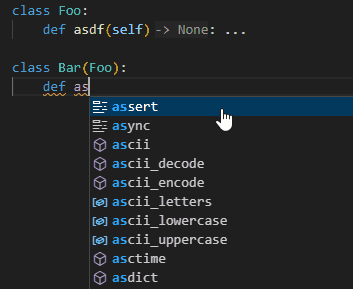
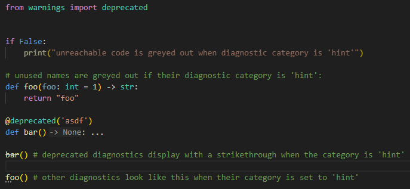
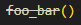
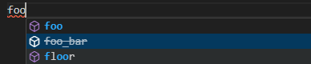

# language server improvements

in addition to the [pylance exclusive features](./pylance-features.md), basedpyright also contains some additional improvements to the language server that aren't available in pyright or pylance.

## autocomplete improvements

autocomplete suggestions for method overrides will automatically add the `@override` decorator:



!!! info "for users targeting python <=3.11"

    since the `@typing.override` decorator was introduced in python 3.12, this functionality is only enabled if either:

    -   you are targeting python 3.12 or above (see [`pythonVersion`](../configuration/config-files.md/#environment-options))
    -   you have enabled [`basedpyright.analysis.useTypingExtensions`](../configuration/language-server-settings.md#based-settings)

!!! warning "important information for library developers"

    using `typing_extensions` creates a runtime dependency on the [`typing_extensions`](https://pypi.org/project/typing-extensions/) pypi package, so you must declare it as a project dependency. this is why `basedpyright.analysis.useTypingExtensions` is disabled by default to prevent users from unknowingly adding a new dependency to their project.

    such mistakes often go undetected until your package is released and causes a runtime error for your users because the module may be available in dev dependencies but not production dependencies. (we recommend using [DTach](https://detachhead.github.io/dtach/usage/commands/#tach-check-external) to detect issues like these)

## improved diagnostic severity system

in pyright, certain diagnostics such as unreachable and unused code are always reported as a hint and cannot be disabled even when the associated diagnostic rule is disabled (and in the case of unreachable code, [the diagnostic is not reported in most cases where the hint is reported](./fixes-for-rules.md#reportunreachable)).

basedpyright introduces a new [`"hint"`](../configuration/config-files.md#diagnostic-categories) diagnostic category which can be applied to any diagnostic rule, and can be disabled just like all other diagnostic rules. some diagnostics use a diagnostic tag (unused or deprecated) if your IDE supports them:

```toml title="pyproject.toml"
[tool.basedpyright]
reportUnreachable = 'hint'
reportUnusedParameter = 'hint'
reportUnusedCallResult = 'hint'
reportDeprecated = 'hint'
```

here's how they look in vscode:



these diagnostic tags will still be present if the rule's diagnostic category is set to `"warning"`, `"error"` or `"information"`, but unlike pyright, they are disabled entirely if the rule's diagnostic category is set to `"none"`.

## deprecated completions

pyright/pylance supports strikethrough diagnostic tags on usages of deprecated symbols:



but basedpyright also shows them in completions:


