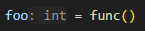
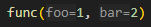
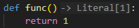
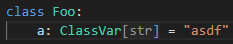

# Language Server Settings

## settings

!!! info "for users migrating from pyright or pylance"
    with the exception of `python.pythonPath` and `python.venvPath`, settings prefixed with `python.*` are not supported in basedpyright. use `basedpyright.*` instead.

The basedpyright language server honors the following settings.

**basedpyright.disableLanguageServices** [boolean]: Disables all language services. This includes hover text, type completion, signature completion, find definition, find references, etc. This option is useful if you want to use pyright only as a type checker but want to run another Python language server for language service features.

**basedpyright.disableOrganizeImports** [boolean]: Disables the “Organize Imports” command. This is useful if you are using another extension that provides similar functionality and you don’t want the two extensions to fight each other.

**basedpyright.disableTaggedHints** [boolean]: Disables the use of hint diagnostics with special tags to tell the client to display text ranges in a "grayed out" manner (to indicate unreachable code or unreferenced symbols) or in a "strike through" manner (to indicate use of a deprecated feature).

**basedpyright.openFilesOnly** [boolean]: Determines whether pyright analyzes (and reports errors for) all files in the workspace, as indicated by the config file. If this option is set to true, pyright analyzes only open files. This setting is deprecated in favor of basedpyright.analysis.diagnosticMode. It will be removed at a future time.

**basedpyright.useLibraryCodeForTypes** [boolean]: This setting is deprecated in favor of basedpyright.analysis.useLibraryCodeForTypes. It will be removed at a future time.

**basedpyright.analysis.autoImportCompletions** [boolean]: Determines whether pyright offers auto-import completions.

!!! note
    this setting is only for import suggestion [*completions*](https://microsoft.github.io/language-server-protocol/specifications/lsp/3.17/specification/#textDocument_completion), which are displayed as you type. it does not affect [import suggestion *code actions*](../benefits-over-pyright/pylance-features.md#import-suggestions), which are tied to the [`reportUndefinedVariable`](./config-files.md#reportUndefinedVariable) diagnostic rule. to disable those, you must disable the diagnostic rule itself.

**basedpyright.analysis.autoSearchPaths** [boolean]: Determines whether pyright automatically adds common search paths like "src" if there are no execution environments defined in the config file.

**basedpyright.analysis.diagnosticMode** ["openFilesOnly", "workspace"]: Determines whether pyright analyzes (and reports errors for) all files in the workspace, as indicated by the config file. If this option is set to "openFilesOnly", pyright analyzes only open files. Defaults to "openFilesOnly"

**basedpyright.analysis.logLevel** ["Error", "Warning", "Information", or "Trace"]: Level of logging for Output panel. The default value for this option is "Information".

**python.pythonPath** [path]: Path to Python interpreter. if you're using vscode, this setting is being deprecated by the VS Code Python extension in favor of a setting that is stored in the Python extension’s internal configuration store. Pyright supports both mechanisms but prefers the new one if both settings are present.

**python.venvPath** [path]: Path to folder with subdirectories that contain virtual environments. The `python.pythonPath` setting is recommended over this mechanism for most users. For more details, refer to the [import resolution](../usage/import-resolution.md#configuring-your-python-environment) documentation.

!!! note
    `python.venvPath` is discouraged in basedpyright. [more info](../benefits-over-pyright/better-defaults.md#default-value-for-pythonpath)

### based settings

the following settings are exclusive to basedpyright

**basedpyright.analysis.inlayHints.variableTypes** [boolean]: Whether to show inlay hints on assignments to variables. Defaults to `true`:



**basedpyright.analysis.inlayHints.callArgumentNames** [boolean]: Whether to show inlay hints on function arguments. Defaults to `true`:



**basedpyright.analysis.inlayHints.callArgumentNamesMatching** [boolean]: Whether to show inlay hints on function arguments when the input expression is a variable with the same name as the parameter. Defaults to `false`.

**basedpyright.analysis.inlayHints.functionReturnTypes** [boolean]: Whether to show inlay hints on function return types. Defaults to `true`:



**basedpyright.analysis.inlayHints.genericTypes** [boolean]: Whether to show inlay hints on inferred generic types. Defaults to `false`:



**basedpyright.analysis.useTypingExtensions** [boolean]: Whether to rely on imports from the `typing_extensions` module when targeting older versions of python that do not include certain typing features such as the `@override` decorator. Defaults to `false`. [more info](../benefits-over-pyright/language-server-improvements.md#autocomplete-improvements)

**basedpyright.analysis.fileEnumerationTimeout** [integer]: Timeout (in seconds) for file enumeration operations. When basedpyright scans your workspace files, it can take a long time in some workspaces. This setting controls when to show a "slow enumeration" warning. Default is 10 seconds.

**basedpyright.analysis.autoFormatStrings** [boolean]: Whether to automatically insert an `f` in front of a string when typing a `{` inside it. Defaults to `true`. [more info](../benefits-over-pyright/pylance-features.md#automatic-conversion-to-f-string-when-typing-inside-a-string)

### discouraged settings

these options can also be configured [using a config file](./config-files.md). it's recommended to use either a `pyproject.toml` or `pyrightconfig.json` file instead of the language server to configure type checking for the following reasons:

- the config should be the same for everybody working on your project. you should commit the config file so that other contributors don't have to manually configure their language server to match yours.
- it ensures that the basedpyright language server behaves the same as the `basedpyright` CLI, which is useful if you have [your CI configured to type check your code](../benefits-over-pyright/improved-ci-integration.md) (you should!)

however these settings are still suppored to maintain compatibility with pyright.

**basedpyright.analysis.diagnosticSeverityOverrides** [map]: Allows a user to override the severity levels for individual diagnostic rules. "reportXXX" rules in the type check diagnostics settings in [configuration](config-files.md#type-check-diagnostics-settings) are supported. Use the rule name as a key and one of "error," "warning," "information," "true," "false," or "none" as value.

**basedpyright.analysis.exclude** [array of paths]: Paths of directories or files that should not be included. This can be overridden in the configuration file.

**basedpyright.analysis.extraPaths** [array of paths]: Paths to add to the default execution environment extra paths if there are no execution environments defined in the config file.

**basedpyright.analysis.ignore** [array of paths]: Paths of directories or files whose diagnostic output (errors and warnings) should be suppressed. This can be overridden in the configuration file.

**basedpyright.analysis.include** [array of paths]: Paths of directories or files that should be included. This can be overridden in the configuration file.

**basedpyright.analysis.stubPath** [path]: Path to directory containing custom type stub files.

**basedpyright.analysis.typeCheckingMode** ["off", "basic", "standard", "strict", "recommended", "all"]: Determines the default type-checking level used by pyright. This can be overridden in the configuration file. (Note: This setting used to be called "basedpyright.typeCheckingMode". The old name is deprecated but is still currently honored.)

**basedpyright.analysis.typeshedPaths** [array of paths]: Paths to look for typeshed modules. Pyright currently honors only the first path in the array.

**basedpyright.analysis.useLibraryCodeForTypes** [boolean]: Determines whether pyright reads, parses and analyzes library code to extract type information in the absence of type stub files. Type information will typically be incomplete. We recommend using type stubs where possible. The default value for this option is true.

#### basedpyright exclusive settings

as mentioned [above](#discouraged-settings), it's recommended to configure these settings [using a config file](./config-files.md) instead.

**basedpyright.analysis.baselineFile** [path]: Path to a baseline file that contains a list of diagnostics that should be ignored. defaults to `./.basedpyright/baseline.json`. [more info](../benefits-over-pyright/baseline.md)

## where do i configure these settings?

the way you configure the basedpyright language server depends on your IDE. below are some examples for [some of the supported editors](../installation/ides.md). this is not a comprehensive list, so if your editor is missing, consult the documentation for its language server support.

### vscode / vscodium

the basedpyright language server settings can be configured using a workspace or global `settings.json`:

```json title="./.vscode/settings.json"
{
    "basedpyright.analysis.diagnosticMode": "openFilesOnly"
}
```

### neovim

The language server can be configured in your neovim settings:

```lua
require("lspconfig").basedpyright.setup {
  settings = {
    basedpyright = {
      analysis = {
        diagnosticMode = "openFilesOnly",
        inlayHints = {
          callArgumentNames = true
        }
      }
    }
  }
}
```

### helix

```toml title="languages.toml"
[language-server.basedpyright]
command = "basedpyright-langserver"
args = ["--stdio"]

[language-server.basedpyright.config]
basedpyright.analysis.diagnosticMode = "openFilesOnly"
```

### zed

```json
{
    "languages": {
        "Python": {
            "language_servers": ["basedpyright"]
        }
    },
    "lsp": {
        "basedpyright": {
            "settings": {
                "python": {
                    "pythonPath": ".venv/bin/python"
                },
                "basedpyright.analysis": {
                    "diagnosticMode": "openFilesOnly"
                }
            }
        }
    }
}
```

### emacs
#### eglot

```lisp
(use-package eglot
  :ensure t
  :config
    (add-to-list 'eglot-server-programs '(
      (python-mode python-ts-mode)
         "basedpyright-langserver" "--stdio"
    ))
    (setq-default
       eglot-workspace-configuration
       '(:basedpyright (
           :typeCheckingMode "recommended"
         )
         :basedpyright.analysis (
           :diagnosticSeverityOverrides (
             :reportUnusedCallResult "none"
           )
           :inlayHints (
             :callArgumentNames :json-false
           )
         )))
)
```
