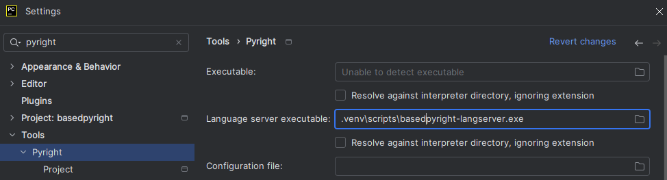
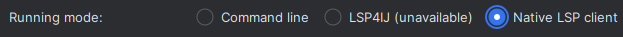
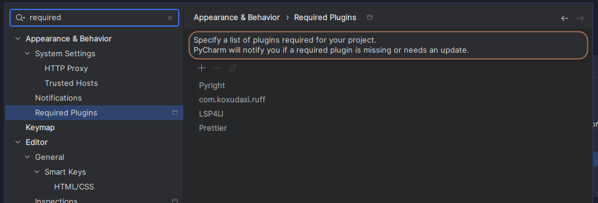

# IDEs

!!! info

    note that most of these editor plugins require [the language server to be installed](./command-line-and-language-server.md).

for information on how to configure the language server in your IDE, [see here](../configuration/language-server-settings.md#where-do-i-configure-these-settings).

## VSCode / VSCodium

=== "VSCode"

    install the extension from [the vscode extension marketplace](https://marketplace.visualstudio.com/items?itemName=detachhead.basedpyright)

    ??? "using basedpyright with pylance (not recommended)"

        unless you depend on any pylance-exclusive features that haven't yet been re-implemented in basedpyright, it's recommended to disable/uninstall the pylance extension.

        if you do want to continue using pylance, all of the options and commands in basedpyright have been renamed to avoid any conflicts with the pylance extension.

        basepyright will automatically disable pylance if it's installed. however if you would like to use basedpyright's diagnostics with pylance's language server, you can change the following settings:

        ```json title=".vscode/settings.json"
        {
            // disable pylance's type checking and only use its language server
            "python.analysis.typeCheckingMode": "off",
            "python.languageServer": "Pylance",

            // disable basedpyright's language server and only use its type checking
            "basedpyright.disableLanguageServices": true
        }
        ```

=== "VSCodium"

    install the extension from [the open VSX registry](https://open-vsx.org/extension/detachhead/basedpyright)

the basedpyright extension will automatically look for the pypi package in your python environment.

!!! warning

    If `basedpyright` is installed within a virtual environment and the official Python extension ([`ms-python`](https://marketplace.visualstudio.com/items?itemName=ms-python.python)) is not installed, the VSCode extension will crash on load. This is a known issue ([#1188](https://github.com/detachhead/basedpyright/issues/1188)) because the automatic python interpreter detection is provided only by `ms-python`.

    The `basedpyright` VSCode extension by design does not depend explicitly on `ms-python`, due to concerns about telemetry.

    There are two workarounds for this problem:

    - Manually install `ms-python`
    - Set `basedpyright.importStrategy` to `useBundled` in your `.vscode/settings.json`

??? tip "if adding basedpyright as a development dependency to your project"

    we recommend adding it to the recommended extensions list in your workspace:

    ```json title=".vscode/extensions.json"
    {
        "recommendations": ["detachhead.basedpyright"]
    }
    ```

    you should commit this file so that it prompts others working on your repo to install the extension as well.

## Neovim

You need to install the LSP client adapter plugin,
[nvim-lspconfig](https://github.com/neovim/nvim-lspconfig), for setting up the
LSP for the editor. These configurations are for launching the LSP server,
as well as for being able to give launching parameters at the same time.

To install the **necessary sever command**, for the LSP server itself, use the
[pypi package installation method](./command-line-and-language-server.md) (as
mentioned previously in this section). Or if already using
[Mason.nvim](https://github.com/williamboman/mason.nvim), follow their
instructions for installing their packages. The latter approach allows you to
have the version of BasedPyright maintained and upgraded by Mason project.

### Setting-up Neovim

BasedPyright is available through the
[`nvim-lspconfig`](https://github.com/neovim/nvim-lspconfig/blob/master/doc/configs.md#basedpyright)
adapter for native Neovim's LSP support.

After having both, the client-side plugin and the LSP server command installed,
simply add this settings to your Neovim's settings:

```lua
local lspconfig = require("lspconfig")
lspconfig.basedpyright.setup{}
```

Further info for this LSP server options for `nvim-lspconfig` are available on
their docs, linked above.

## Vim

Vim users can install [coc-basedpyright](https://github.com/fannheyward/coc-basedpyright), the BasedPyright extension for coc.nvim.

## Sublime Text

Sublime text users can install both [LSP](https://packagecontrol.io/packages/LSP) and [LSP-basedpyright](https://packagecontrol.io/packages/LSP-basedpyright) via [Package Control](https://packagecontrol.io).

## Emacs

Emacs users have 3 options:

=== "lsp-bridge"

    basedpyright is the default language server for python in [lsp-bridge](https://github.com/manateelazycat/lsp-bridge), so no additional configuration is required.

=== "eglot"

    add the following to your emacs config:

    ```emacs-lisp
    (add-to-list 'eglot-server-programs
                '((python-mode python-ts-mode)
                "basedpyright-langserver" "--stdio"))
    ```

=== "lsp-mode"

    with [lsp-pyright](https://github.com/emacs-lsp/lsp-pyright) (any commit after: `0c0d72a`, update the package if you encounter errors), add the following to your emacs config:

    ```emacs-lisp
    (setq lsp-pyright-langserver-command "basedpyright")
    ```

## PyCharm

=== "PyCharm Community"

    1. install the [LSP4IJ](https://plugins.jetbrains.com/plugin/23257-lsp4ij) plugin
    2. install the [Pyright](https://plugins.jetbrains.com/plugin/24145) plugin
    3. configure it to use basedpyright by specifying `basedpyright-langserver` as the executable and check the "Resolve against interpreter directory, ignoring extension" checkbox:\
        
    4. set "Running mode" to "LSP4IJ":\
        

=== "PyCharm Professional / IntelliJ IDEA Ultimate"

    1. install the [Pyright](https://plugins.jetbrains.com/plugin/24145) plugin
    3. configure it to use basedpyright by specifying `basedpyright-langserver` as the executable and check the "Resolve against interpreter directory, ignoring extension" checkbox:\
        
    3. set "Running mode" to "Native LSP client":\
        

!!! tip

    if you're adding basedpyright as a development dependency to your project, we recommend configuring these settings as overrides in the "Project" menu, and configuring the pyright plugin (and LSP4IJ if using pycharm community) as a recommended dependency:

    


    you should then commit the following generated config files, so that others working on your repo are promted to install the plugin and don't have to manually configure it themselves:

    - `.idea/pyright-overrides.xml`
    - `.idea/pyright.xml`
    - `.idea/externalDependencies.xml`

    (note that pycharm hides the `.idea` directory by default, so you will need to `git add` the files via the CLI instead.)

## Helix

Install the LSP server itself, using the [pypi package installation method](./command-line-and-language-server.md) (as mentioned previously in this section).
Then add the following to your [languages file](https://docs.helix-editor.com/languages.html):

```toml
[[language]]
name = "python"
language-servers = [ "basedpyright" ]
```

You can verify the active configuration by running `hx --health python`

## Zed

Install the [BasedPyright extension](https://github.com/m1guer/basedpyright-zed) through Zed's extension manager.

Enable and configure basedpyright under Zed settings:

```json
{
    "languages": {
        "Python": {
            "language_servers": ["basedpyright"]
        }
    }
}
```
