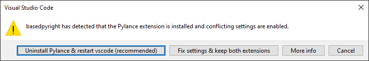

# IDEs

!!! info

    note that most of these editor plugins require [the language server to be installed](./command-line-and-language-server.md).

## VSCode / VSCodium

### VSCode

install the extension from [the vscode extension marketplace](https://marketplace.visualstudio.com/items?itemName=detachhead.basedpyright)

??? "using basedpyright with pylance (not recommended)"

    unless you depend on any pylance-exclusive features that haven't yet been re-implemented in basedpyright, it's recommended to disable/uninstall the pylance extension.

    if you do want to continue using pylance, all of the options and commands in basedpyright have been renamed to avoid any conflicts with the pylance extension, and the restriction that prevents both extensions from being enabled at the same time has been removed.

    if basedpyright detects that pylance is installed, you will see a popup prompting you to choose whether to uninstall pylance or fix your settings to allow both extensions to work without overlapping functionality:

    

    clicking "Fix settings & keep both extensions" will set the following settings for you automatically:

    ```jsonc
    // .vscode/settings.json
    {
        "python.analysis.typeCheckingMode": "off",
        "basedpyright.disableLanguageServices": true
    }
    ```

### VSCodium

install the extension from [the open VSX registry](https://open-vsx.org/extension/detachhead/basedpyright)

### usage

the basedpyright extension will automatically look for the pypi package in your python environment.

if you're adding basedpyright as a development dependency in your project, we recommend adding it to the recommended extensions list in your workspace to prompt others working on your repo to install it:

```jsonc
// .vscode/extensions.json

{
    "recommendations": ["detachhead.basedpyright"]
}
```

## Neovim

You need to install the LSP client addapter plugin,
[nvim-lspconfig](https://github.com/neovim/nvim-lspconfig), for setting up the
LSP for the editor. These configurations are for launching the LSP server,
as well as for being able to give launching parameters at the same time.

To install the **necessary sever command**, for the LSP server itself, use the
[pypi package installation method](#command-line--language-server) (as
mentioned previously in this section). Or if already using
[Mason.nvim](https://github.com/williamboman/mason.nvim), follow their
instructions for installing their packages. The latter approach allows you to
have the version of BasedPyright maintained and upgraded by Mason project.

### Setting-up Neovim

BasedPyright is available through the
[`nvim-lspconfig`](https://github.com/neovim/nvim-lspconfig/blob/master/doc/server_configurations.md#basedpyright)
adapter for native Neovim's LSP support.

After having both, the client-side plugin and the LSP server command installed,
simply add this settings to your Neovim's settings:

```lua
local lspconfig = require("lspconfig")
lspconfig.basedpyright.setup{}
```

Further info for this LSP server options for `nvim-lspconfig` are available on
their docs, linked above.

## Vim

Vim users can install [coc-basedpyright](https://github.com/fannheyward/coc-basedpyright), the BasedPyright extension for coc.nvim.

## Sublime Text

Sublime text users can install both [LSP](https://packagecontrol.io/packages/LSP) and [LSP-basedpyright](https://packagecontrol.io/packages/LSP-basedpyright) via [Package Control](https://packagecontrol.io).

## Emacs

Emacs users have 3 options:

### [lsp-bridge](https://github.com/manateelazycat/lsp-bridge)

basedpyright is the default language server for python in lsp-bridge, so no additional configuration is required.

### [eglot](https://github.com/joaotavora/eglot)

add the following to your emacs config:

```emacs-lisp
(add-to-list 'eglot-server-programs
             '((python-mode python-ts-mode)
               "basedpyright-langserver" "--stdio"))
```

### [lsp-mode](https://github.com/emacs-lsp/lsp-mode)

with [lsp-pyright](https://github.com/emacs-lsp/lsp-pyright) (any commit after: `0c0d72a`, update the package if you encounter errors), add the following to your emacs config:

```emacs-lisp
(setq lsp-pyright-langserver-command "basedpyright")
```

## PyCharm

install the [Pyright](https://plugins.jetbrains.com/plugin/24145) plugin

configure it to use basedpyright by specifying the path to the `basedpyright-langserver` executable and set "Running mode" to "LSP4IJ":


## Helix

Install the LSP server itself, using the [pypi package installation method](#command-line--language-server) (as mentioned previously in this section).
Then add the following to your [languages file](https://docs.helix-editor.com/languages.html):

```toml
[[language]]
name = "python"
language-servers = [ "basedpyright" ]
```

You can verify the active configuration by running `hx --health python`
